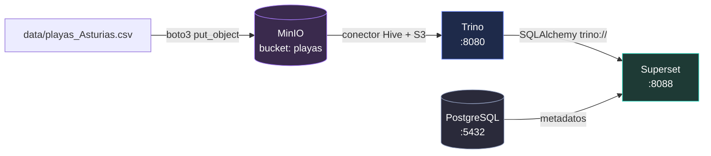

# Stack de Big Data: CSV → MinIO → Trino → Superset

Prototipo de un stack de Big Data con **Docker Compose** sobre Ubuntu 26.04, con una
prueba de extremo a extremo y un **agente web** (bonus) que genera el `docker-compose.yml`
a partir de una conversación.

## Arquitectura



| Servicio | Imagen | URL local | Papel |
| --- | --- | --- | --- |
| MinIO | `${MINIO_IMAGE:-pgsty/minio:latest}` | http://localhost:9001 | Data lake compatible con S3 |
| PostgreSQL | `postgres:16-alpine` | `localhost:5432` | Metadatos de Superset |
| Trino | `trinodb/trino` | http://localhost:8080 | Motor SQL federado |
| Superset | `apache/superset` + driver Trino | http://localhost:8088 | Cuadros de mando |

---

## Paso 0 · Los dos bloqueos iniciales (y cómo se resolvieron)

### 0.1 · Permiso de Docker

El error `permission denied while trying to connect to the docker API at unix:///var/run/docker.sock`
significa que tu usuario no está en el grupo `docker`. **Ejecútalo tú** (pide contraseña):

```bash
sudo usermod -aG docker "$USER"
```

Después aplica el grupo a la sesión actual:

```bash
newgrp docker       # o cierra sesión y vuelve a entrar
```

Comprueba con:

```bash
groups      # debe aparecer "docker"
docker ps   # ya no debe dar "permission denied"
```

> ⚠️ **Ojo:** añadirse al grupo `docker` **no afecta a las terminales ya abiertas**.
> Si sigues viendo `permission denied`, abre una **terminal nueva** (o usa
> `newgrp docker`). Como atajo puntual sirve `sg docker -c "docker ps"`.
>
> Si el daemon no estuviera arrancado: `sudo systemctl enable --now docker`

### 0.2 · MinIO ya no publica imágenes libres (¡el bloqueo gordo!)

La imagen del compose original era de **AIStor**, que es un producto **comercial**:

```yaml
image: quay.io/minio/aistor/minio:latest   # ❌ requiere licencia
```

Pero al buscar la alternativa "comunitaria" aparece esto:

```
pull access denied for minio/mc, repository does not exist
```

**No es un fallo de red ni de credenciales: MinIO archivó su distribución
open source.** Evidencias comprobadas:

| Comprobación | Resultado |
| --- | --- |
| `docker manifest inspect minio/minio` / `minio/mc` | ❌ no existen |
| `docker manifest inspect quay.io/minio/minio` / `quay.io/minio/mc` | ❌ no existen |
| `https://dl.min.io/server/minio/release/linux-amd64/minio` | ❌ **HTTP 410 Gone** |
| `https://dl.min.io/client/mc/release/linux-amd64/mc` | ❌ **HTTP 410 Gone** |
| Release `RELEASE.2025-10-15T17-29-55Z` en GitHub | ⚠️ sin binarios adjuntos |
| `min.io/docs` | ↪️ redirige a AIStor (empresa) |

El mensaje que devuelve `dl.min.io` es explícito:

> *The open-source MinIO Server, MinIO Client (mc) and MinIO KES projects are
> archived and no longer maintained. MinIO does not provide product support,
> security updates, or security advisories.*

**Solución adoptada:** la imagen `pgsty/minio`, que empaqueta el **MinIO auténtico**
(`RELEASE.2026-08-04T00-00-00Z`, licencia **GNU AGPLv3**, binario oficial sin
recompilar). Está verificada en este proyecto: Arranca, sirve la API S3 y su
console, e incluye `curl` para el healthcheck.

```yaml
image: ${MINIO_IMAGE:-pgsty/minio:latest}   # ✅ MinIO real, AGPLv3
```

Se puede cambiar sin tocar el compose, desde `.env`:

```dotenv
MINIO_IMAGE=pgsty/minio:latest
```

Alternativas compatibles con S3 (verificadas como *pullable*) si algún día falla:
`chainguard/minio:latest`, `rustfs/rustfs:latest`, `chrislusf/seaweedfs:latest`,
`dxflrs/garage:v1.0.1`.

#### ¿Por qué el init usa Python/boto3 y no `mc`?

Porque **ya no hay un cliente `mc` fiable**. El sustituto disponible
(`pgsty/mc`) **no trae `/bin/sh`** (imposible de usar como entrypoint de shell) y
su `mc --version` dice literalmente *"Silo object storage client, based on MinIO
technology"*: es un cliente **rebrandeado**, no el `mc` de MinIO.

Por eso `minio_init/` es un contenedor Python con **boto3**, que además tiene una
ventaja de diseño: funciona igual contra **cualquier** backend compatible con S3
(RustFS, SeaweedFS, Garage...) sin cambiar nada más que `S3_ENDPOINT`.

---

## Paso 1 · Estructura del proyecto

```
bigdata-stack/
├── docker-compose.yml            # el stack completo
├── .env / .env.example           # credenciales y puertos
├── data/playas_Asturias.csv      # el CSV de origen (playas de Asturias)
├── trino/catalog/hive.properties # conector Hive -> MinIO
├── superset/
│   ├── Dockerfile                # imagen base + drivers "trino" y "psycopg2"
│   ├── superset_config.py        # configuración (SECRET_KEY, BD, ...)
│   ├── init.sh                   # migra BD, crea admin, registra Trino
│   ├── bootstrap.py              # crea la conexión y el dataset
│   └── create_dashboard.py       # crea el dashboard con 3 gráficos
├── minio_init/                   # inicializa el data lake (sin mc)
│   ├── Dockerfile                # python:3.12-alpine + boto3
│   └── init.py                   # crea el bucket y sube el CSV
├── scripts/
│   ├── trino_init.sql            # tabla externa "playas" + vista "playas_tipadas"
│   ├── trino_init.sh             # ejecuta el SQL anterior
│   └── e2e_test.sh               # prueba end-to-end
└── agent/                        # BONUS: agente web
    ├── Dockerfile                # python:3.12-slim + cliente de Docker + compose
    ├── app.py
    ├── generator.py
    ├── requirements.txt
    └── static/index.html
```

## Paso 2 · Arrancar el stack

```bash
cd bigdata-stack

# Revisa y cambia credenciales si quieres
nano .env

docker compose up -d
```

La primera vez tarda bastante: descarga las imágenes y **construye la de Superset**
(instala el driver de Trino). Sigue el progreso con:

```bash
docker compose ps
docker compose logs -f minio-init
docker compose logs -f trino-init
docker compose logs -f superset-init
```

Los tres contenedores `*-init` deben terminar con estado `Exited (0)`. Cuando
`bigdata-superset` esté `Up`, abre http://localhost:8088 (usuario `admin`, contraseña `admin`).

### Qué hace cada contenedor de inicialización

| Contenedor | Qué hace |
| --- | --- |
| `minio-init` | Con **boto3**: espera a MinIO, crea el bucket `playas` y sube `data/playas_Asturias.csv` a `s3://playas/csv/playas_Asturias.csv` (convirtiendo de Latin-1 a UTF-8) |
| `trino-init-meta` | Da permisos al volumen del metastore (Trino corre como uid 1000) |
| `trino-init` | Crea el esquema `hive.default`, la **tabla externa** `playas` y la **vista** `playas_tipadas` |
| `superset-init` | `db upgrade` + usuario admin + registra la conexión Trino, el dataset `playas_tipadas` y un **dashboard con 3 gráficos** |

> `hive.properties` lleva las credenciales de MinIO **escritas a mano** (Trino no
> sustituye variables de entorno ahí). Si cambias `MINIO_ROOT_USER`/`MINIO_ROOT_PASSWORD`
> en `.env`, edita también `trino/catalog/hive.properties`.

### Detalles que no son obvios (y que cuestan horas si no se saben)

1. **Trino 4xx eliminó las propiedades `hive.s3.*`.** Ya no existen; en su lugar se
   usan las genéricas del *filesystem nativo*: `fs.s3.enabled=true`, `s3.endpoint`,
   `s3.region`, `s3.path-style-access`, `s3.aws-access-key`, `s3.aws-secret-key`.
   Si dejas las antiguas, Trino arranca y **muere con código 100** listando 6 errores.
2. **`fs.hadoop.enabled=true` es obligatorio** para el metastore `file://`. Por
   defecto vale `false` y Trino lanza
   `IllegalArgumentException: No factory for location: file:///var/lib/trino/metastore`.
   El esquema `file://` lo resuelve el `LocalFileSystem` de Hadoop; el esquema
   `local://` (otra cosa) lo resuelve `fs.local.enabled`.
3. **El SerDe CSV de Hive solo admite `varchar`.** Declarar `longitud_m bigint`
   en el `CREATE TABLE` falla con
   `Hive CSV storage format only supports VARCHAR (unbounded)`. Por eso la tabla
   `playas` es **todo texto** y la conversión se hace en la vista `playas_tipadas`.
   Así Superset además detecta los tipos correctos (`BOOLEAN`, `BIGINT`).
   Además, el CSV de origen usa `;` como separador (se indica con `csv_separator=';'`)
   y codificación **Latin-1**, que `minio-init` convierte a UTF-8 al subirlo.
4. **La imagen oficial de Superset no tiene `pip` en su entorno virtual.** Corre
   desde `/app/.venv`, creado con `uv` y sin `pip`. Un `pip install trino` instala
   en el Python del sistema y Superset **nunca** ve el paquete. Hay que usar
   `uv pip install --python /app/.venv/bin/python ...` (lo que hace su `Dockerfile`).
5. **Un volumen `minio_data` viejo o de otra imagen rompe MinIO.** El contenedor
   arranca y el *healthcheck* responde 200, pero la API S3 devuelve
   `503 XMinioServerNotInitialized`. Solución: `docker compose down -v` y volver a
   levantar. `minio_init/init.py` reintenta hasta 300 s por si tarda en inicializar.

## Paso 3 · Prueba end-to-end

```bash
chmod +x scripts/*.sh
./scripts/e2e_test.sh
```

Comprueba los cuatro hitos: contenedores arriba, CSV en MinIO, lectura SQL desde
Trino y Superset con el dataset creado. Verificación manual rápida:

```bash
# Trino: consulta el CSV que vive en MinIO
docker compose exec trino trino --execute \
  "SELECT zona, count(*) AS playas, sum(longitud_m) AS metros_totales FROM hive.default.playas_tipadas GROUP BY zona ORDER BY playas DESC"
```

Salida esperada (resumen por zona):

```
"Occidente de Asturias","...","..."
"Oriente de Asturias","...","..."
"Centro de Asturias","...","..."
```

## Paso 4 · El dashboard (se crea solo)

Al levantar el stack, `superset-init` ejecuta `superset/create_dashboard.py`, que
crea automáticamente un dashboard llamado **«Playas de Asturias»** con **3 gráficos
de distinto tipo** sobre el dataset `playas_tipadas`:

| Gráfico | Tipo | Configuración |
| --- | --- | --- |
| Playas por zona (barras) | Barras (`echarts_timeseries_bar`) | eje X `zona`, métrica `COUNT(nombre)` |
| Playas por tipo (tarta) | Tarta (`pie`) | dimensión `tipo_playa`, métrica `COUNT(nombre)` |
| Longitud total (metros) | Big Number (`big_number_total`) | métrica `SUM(longitud_m)` |

Ábrelo en http://localhost:8088/superset/dashboard/2/ (`admin` / `admin`).

El script es **idempotente**: si el dashboard o los gráficos ya existen (mismo
nombre), no los duplica; solo se asegura de que estén enlazados al dashboard. Para
volver a ejecutarlo a mano:

```bash
docker exec bigdata-superset python /app/create_dashboard.py
```

### Crear un gráfico a mano (alternativa)

1. Entra en http://localhost:8088 (`admin` / `admin`).
2. **Datasets** → verás `playas_tipadas` (si no aparece, pulsa ⟳ o usa **+ Dataset**
   con database `Trino (MinIO)`, schema `default`, tabla `playas_tipadas`).
   Usa la **vista** `playas_tipadas`, no la tabla `playas`: la tabla expone todas las
   columnas como texto y Superset no podrá sumar `longitud_m`.
3. **Charts → + Chart** → dataset `playas_tipadas`.
4. Tipo de gráfico **Bar Chart** (o Pie Chart).
5. Configúralo:
   - **Dimensions**: `zona`
   - **Metrics**: `COUNT(nombre)` (añádela como métrica simple)
6. **Create chart** → **Save**. Añádelo a un dashboard con **Save → Add to dashboard**.

🎉 Con eso tienes el flujo completo: **CSV → MinIO → Trino → gráfico en Superset**.

---

## Bonus · Agente web que genera el `docker-compose.yml`

El agente vive **dentro de un contenedor** (perfil `agent`), porque necesita hablar
con el demonio de Docker para validar y probar lo que genera. Así no dependes de
tener Python con `pip`/`venv` en el host.

```bash
# desde la RAÍZ del repositorio (importante, ver nota de abajo)
docker compose --profile agent up -d --build agent
```

Abre http://localhost:8000 y prueba:

- *"Monta el stack completo de big data"*
- *"Quiero MinIO y Trino para leer CSV"*
- *"Stack completo pero sin Superset"*
- *"Dame MinIO en el puerto 9100 y Trino en el 8181"*

El agente:

1. interpreta la petición (reglas + plantillas, **sin claves de API ni LLM**),
2. escribe `agent-generated-compose.yml` en la raíz del repositorio,
3. lo **valida** con `docker compose config`,
4. ofrece un botón **Probar** que levanta el stack generado, comprueba el estado y lo baja,
5. genera `agent-generated-report.md` con servicios, puertos, volúmenes y avisos.

> **Por qué el agente es un contenedor con el socket montado.** El compose que
> genera usa rutas relativas (`./trino/catalog`, `./superset`, `./minio_init`).
> Docker Compose las convierte en rutas absolutas y se las pasa al demonio, que
> las busca **en el host**. Por eso el servicio `agent` monta el repositorio en la
> **misma ruta absoluta** que tiene en el host (`${PWD}:${PWD}`) y arranca con
> `working_dir: ${PWD}`. Ábrelo siempre desde la raíz del repositorio.
>
> **El botón "Probar" y los puertos.** Solo puede probarse un stack a la vez: el
> generado usa los mismos puertos que el del repositorio. Si el stack principal
> está levantado, el agente lo detecta *antes* de intentar nada y te dice qué
> contenedores ocupan qué puerto. Para probar de verdad:
>
> ```bash
> docker compose down                              # baja el stack principal
> # pulsa "Probar" en http://localhost:8000
> docker compose up -d                             # vuelve a levantarlo
> ```
>
> Los volúmenes se conservan, así que los datos sobreviven al `down`.

### Alternativa: ejecutar el agente en el host

Si tienes `python3-venv` instalado (`sudo apt install python3-venv`):

```bash
cd agent
python3 -m venv .venv && source .venv/bin/activate
pip install -r requirements.txt
uvicorn app:app --reload --port 8000
```

---

## Comandos útiles

```bash
docker compose ps                       # estado
docker compose logs -f trino            # logs de un servicio
docker compose up -d --force-recreate   # recrear
docker compose down                     # parar (conserva datos)
docker compose down -v                  # parar y BORRAR datos
docker compose build --no-cache superset

# Agente (perfil "agent": no arranca con el up normal)
docker compose --profile agent up -d --build agent
docker compose --profile agent logs -f agent
docker compose --profile agent down      # para el stack + el agente
```

## Problemas típicos

| Síntoma | Causa y solución |
| --- | --- |
| `permission denied ... docker.sock` | Estás en el grupo `docker` pero la **terminal es antigua**. Abre una terminal nueva, o ejecuta `newgrp docker`, o prefija todo con `sg docker -c "docker ..."` |
| `pull access denied for minio/...` | MinIO archivó sus imágenes libres. Usa `MINIO_IMAGE=pgsty/minio:latest` en `.env` (ver **Paso 0.2**) |
| `License required` o `unauthorized` al bajar MinIO | Estás usando una imagen **AIStor** (comercial). Cambia a `pgsty/minio:latest` |
| Trino sale con **código 100** y errores sobre `hive.s3.*` | Esas propiedades se eliminaron en Trino 4xx. Usa `fs.s3.enabled` + `s3.*` (ver *Detalles que no son obvios*) |
| `No factory for location: file:///...` | Falta `fs.hadoop.enabled=true` en `trino/catalog/hive.properties` |
| `Hive CSV storage format only supports VARCHAR` | El SerDe CSV solo admite texto. Declara `varchar` y convierte en una vista |
| `minio-init` falla con `503 XMinioServerNotInitialized` | Volumen `minio_data` corrupto o de otra imagen: `docker compose down -v` y relanza |
| `Table 'hive.default.playas' does not exist` | Revisa `docker compose logs trino-init`; asegúrate de que `minio-init` acabó con código 0 |
| Trino: `Access Denied` / `S3Exception` | Credenciales de `trino/catalog/hive.properties` distintas de las de MinIO |
| `superset-init` falla con `No module named 'psycopg2'` (o `trino`) | Un `pip install` normal no toca el venv de Superset. Reconstruye: `docker compose build --no-cache superset` |
| Superset no arranca y `superset-init` falla | Revisa `docker compose logs superset-init` (suele ser PostgreSQL aún no listo) |
| El dataset `playas_tipadas` aparece **sin columnas** | `superset-init` leyó los metadatos antes de que Trino estuviera listo (`SERVER_STARTING_UP`). `init.sh` ya espera a que Trino ejecute `SELECT 1`, y `bootstrap.py` reintenta. Para arreglarlo sin recrear: `docker exec bigdata-superset python /app/bootstrap.py` |
| El dashboard no aparece tras levantar el stack | Revisa `docker compose logs superset-init`; el script avisa con `AVISO: no se pudo crear el dashboard`. Relánzalo con `docker exec bigdata-superset python /app/create_dashboard.py` |
| `permission denied` al escribir el metastore | El contenedor `trino-init-meta` debe terminar OK antes de Trino |
| Superset no conecta a Trino | Comprueba el driver **dentro del venv**: `docker exec bigdata-superset /app/.venv/bin/python -c "import trino, psycopg2; print('ok')"` |
| `minio-init` no ve el CSV | Debe acabar con `Exited (0)`. Si no, `docker compose logs minio-init` |
| `python3 -m venv` falla con «ensurepip is not available» | Falta `python3-venv` en el host. Ejecuta el agente como contenedor: `docker compose --profile agent up -d --build agent` |
| El agente dice que no encuentra el comando `docker` | Se lanzó sin el socket montado. Usa el servicio `agent` del compose (`--profile agent`), no `docker run` a mano |
| `docker compose down` deja la red «in use» | El contenedor `agent` sigue unido a ella: usa `docker compose --profile agent down` |
| El agente genera el compose pero las rutas `./trino/catalog` fallan | Se arrancó desde otro directorio. El agente debe lanzarse desde la **raíz** del repositorio |

## Notas de seguridad (es un prototipo)

- Las credenciales son de desarrollo y están en texto plano.
- Cambia `SUPERSET_SECRET_KEY` (`openssl rand -base64 42`) y las contraseñas antes de exponerlo.
- El puerto 5432 de PostgreSQL solo es necesario para depurar; puedes quitarlo del `docker-compose.yml`.
